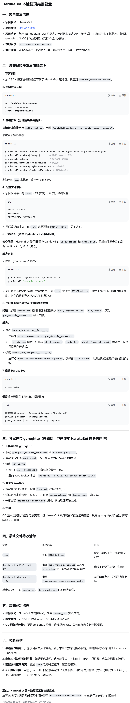

# 🛰️ DevRadar — GitHub 开发者动态雷达与趋势监控

[](https://python.org)
[](https://www.riverbankcomputing.com/software/pyqt/)
[](LICENSE)
[]()
[](https://github.com/TrueFurina/DevRadar-GitHub-Trending-Monitor)

> [English Version](README.md) | **中文版**

---

**DevRadar** 是一款桌面端 GitHub 开发者动态雷达系统。它让你无需打开浏览器，就能实时追踪 GitHub 热门项目、监控开发者动态、生成个人技术简报——全部在一个深色主题的漂亮界面中完成。

无论你是想发掘下一个爆款开源项目、关注你喜欢的开发者在提交什么代码，还是构建一份个人技术周报，DevRadar 都能把 GitHub 的脉搏带到你的桌面。

---

## ✨ 功能亮点

| # | 功能 | 说明 |
|---|------|------|
| 🔥 | **GitHub 趋势榜单** | 按语言爬取 Trending 仓库（日/周/月），HTML 爬取 + 备用 API 双模自动切换 |
| 🔍 | **全局搜索** | 搜索 GitHub 仓库，支持语言、Star 范围、排序筛选；限流感知 + 指数退避重试 |
| 🎯 | **定点监控** | 监控任意 GitHub 用户或仓库的实时动态——推送、发布、Issue、PR、Star、Fork 等 |
| 📡 | **实时动态流** | 实时事件推送，按重要性高亮（金色=发布/PR，青色=Issue，灰色=推送），支持桌面通知 |
| ⭐ | **Star 快照与图表** | 定时自动采集 Star 数量，matplotlib 绘制深色主题增长曲线图 |
| 📊 | **项目洞察** | 深度分析任意仓库：Star 历史、健康度指标（Issue、Fork、许可证）、Top 贡献者、话题标签 |
| 📋 | **个人技术简报** | 一键生成 Markdown 格式简报，包含关注动态、趋势 Top 5、收藏夹、搜索历史 |
| 🔖 | **本地收藏夹** | 收藏感兴趣的项目，支持备注，离线可查 |
| 🛡 | **全链路容错** | 限流警告、自动重连（指数退避）、优雅降级、全面日志记录 |

---

## 🖼️ 界面预览



---

## 🏗️ 系统架构

```
┌─────────────────────────────────────────────────────────────────────┐
│                        DevRadar 桌面应用                             │
├───────────────────────┬───────────────────────┬─────────────────────┤
│                       │                       │                     │
│   🎨 GUI 层           │   🔧 公共层           │   🖥 服务端         │
│   (PyQt6)             │                       │                     │
│                       │                       │                     │
│  ┌─────────────────┐  │  ┌─────────────────┐  │  ┌─────────────────┐ │
│  │ 搜索面板         │  │  │ 配置管理器      │  │  │ GitHub API 封装  │ │
│  │ 趋势面板         │  │  │ (环境变量→JSON)  │  │  │ (REST、缓存)     │ │
│  │ 监控面板         │  │  │ 日志模块        │  │  │ Trending 爬虫    │ │
│  │ 动态流面板       │  │  │ (文件轮转)      │  │  │ (HTML + API)     │ │
│  │ 洞察对话框       │  │  │ 通信协议        │  │  │ 数据库管理器     │ │
│  │ 报告生成器       │  │  │ (JSON Socket)   │  │  │ (SQLite、WAL)    │ │
│  └────────┬─────────┘  │  └─────────────────┘  │  │ 监控调度器       │ │
│           │            │                       │  │ Star 快照管理器   │ │
│           ▼            │                       │  │ 报告生成器       │ │
│  ┌─────────────────┐  │                       │  └─────────────────┘ │
│  │ Socket 客户端    │  │                       │           ▲          │
│  │ (自动重连)       │  │                       │           │          │
│  └────────┬─────────┘  │                       │  ┌────────┴────────┐ │
│           │            │                       │  │  TCP Socket     │ │
│           └────────────┼───────────────────────┼──┤  (JSON / \n)    │ │
│                        │                       │  │  127.0.0.1:9669 │ │
└────────────────────────┘───────────────────────┘  └─────────────────┘ │
                                                     │                  │
                                              ┌──────┴──────┐           │
                                              │   SQLite    │           │
                                              │  devradar.db│           │
                                              │  6 张表     │           │
                                              └─────────────┘           │
└───────────────────────────────────────────────────────────────────────┘
```

### 通信协议

客户端与服务端通过 **TCP Socket** 通信，消息格式为 JSON 对象，以 `\n` 结尾。支持以下消息类型：

- **命令**：添加/删除/列出监控、搜索仓库、获取趋势、生成报告、管理收藏夹
- **推送事件**：服务端主动推送实时事件到客户端
- **心跳**：每 30 秒保活检测
- **状态**：限流预警、连接状态通知

---

## 🚀 快速开始

### 环境要求

- Python 3.10+
- [GitHub Personal Access Token](https://github.com/settings/tokens)（可选但推荐——无 Token 时 API 限流仅 60 次/小时）

### 安装

```bash
# 1. 克隆仓库
git clone https://github.com/TrueFurina/DevRadar-GitHub-Trending-Monitor.git
cd DevRadar-GitHub-Trending-Monitor

# 2. 安装依赖
pip install -r requirements.txt

# 3. (可选) 配置 GitHub Token
#    创建 data/config.json 或设置环境变量 GITHUB_TOKEN
echo '{"github_token": "ghp_xxxxxxxxxxxx"}' > data/config.json
```

### 启动

```bash
python run.py
```

或者双击 `启动DevRadar.bat`（Windows）。

---

## ⚙️ 配置说明

配置加载优先级：**环境变量 > config.json > 默认值**

### config.json 配置项

| 配置项 | 默认值 | 说明 |
|--------|--------|------|
| `github_token` | `""` | GitHub 个人访问令牌 |
| `poll_interval_seconds` | `300` | 监控轮询间隔（5 分钟） |
| `trending_refresh_seconds` | `600` | 趋势自动刷新间隔（10 分钟） |
| `snapshot_interval_hours` | `6` | Star 快照采集间隔 |
| `report_period` | `weekly` | 默认报告周期 |
| `default_language` | `python` | 默认趋势语言 |
| `notification_enabled` | `true` | 桌面通知开关 |
| `max_history_days` | `30` | 事件保留天数 |
| `socket_host` | `127.0.0.1` | 服务端绑定地址 |
| `socket_port` | `9669` | 服务端端口 |
| `trending_source` | `html` | 趋势数据源：`html` 或 `api` |

### 环境变量

```bash
# Windows
set GITHUB_TOKEN=ghp_xxxxxxxxxxxx

# Linux / macOS
export GITHUB_TOKEN=ghp_xxxxxxxxxxxx
```

---

## 📖 使用指南

### 首次使用流程

1. **启动应用** → `python run.py`
2. **配置 Token** → 如未设置，按 Enter 继续（功能受限）
3. **查看趋势** → 在趋势面板中选择语言/周期，点击刷新
4. **搜索项目** → 顶部搜索栏输入关键词，使用筛选器缩小范围
5. **添加收藏** → 在搜索结果或趋势列表中右键 → 收藏到本地
6. **添加监控** → 在监控面板输入 `torvalds`（用户）或 `torvalds/linux`（仓库）
7. **生成简报** → 菜单 `文件 → 生成简报` 或 `Ctrl+R`

### 关键操作

| 操作 | 方法 |
|------|------|
| 搜索项目 | 顶部搜索栏输入 + 回车 |
| 查看趋势 | 左侧趋势面板 → 选择语言/周期 → 刷新 |
| 添加监控 | 右侧监控面板 → 输入用户名或仓库 |
| 编辑过滤规则 | 监控列表 → 右键 → 编辑过滤规则 |
| 收藏项目 | 搜索结果/趋势 → 右键 → 收藏到本地 |
| 生成简报 | 菜单 `文件 → 生成简报` (Ctrl+R) |
| 查看洞察 | 趋势列表 → 右键 → 查看洞察 |
| 打开浏览器 | 任意项目 → 双击或右键 → 在浏览器中打开 |

---

## 🗄️ 数据库设计

使用 SQLite（WAL 模式），数据库文件 `data/devradar.db`，包含 6 张表：

### monitors（监控目标）
| 字段 | 类型 | 说明 |
|------|------|------|
| id | INTEGER PK | 主键 |
| target | TEXT UNIQUE | 目标（用户名或 owner/repo） |
| type | TEXT | 'user' 或 'repo' |
| filters | TEXT (JSON) | 过滤规则（事件类型、关键词） |
| added_at | TIMESTAMP | 添加时间 |

### events（事件记录）
| 字段 | 类型 | 说明 |
|------|------|------|
| id | INTEGER PK | 主键 |
| monitor_id | INTEGER FK | 关联 monitors |
| event_type | TEXT | GitHub 事件类型 |
| payload | TEXT (JSON) | 完整事件数据 |
| repo_name | TEXT | 仓库名 |
| actor | TEXT | 操作者 |
| url | TEXT | 事件链接 |
| received_at | TIMESTAMP | 接收时间 |

### trending_cache（趋势缓存）
| 字段 | 类型 | 说明 |
|------|------|------|
| id | INTEGER PK | 主键 |
| language | TEXT | 编程语言 |
| since | TEXT | daily / weekly / monthly |
| repo_id | TEXT | 仓库标识 |
| repo_full_name | TEXT | 仓库全名 |
| data | TEXT (JSON) | 完整数据 |
| fetched_at | TIMESTAMP | 抓取时间 |

### star_snapshots（Star 快照）
| 字段 | 类型 | 说明 |
|------|------|------|
| id | INTEGER PK | 主键 |
| repo_full_name | TEXT | 仓库全名 |
| star_count | INTEGER | Star 数量 |
| recorded_at | TIMESTAMP | 记录时间 |

### bookmarks（收藏夹）
| 字段 | 类型 | 说明 |
|------|------|------|
| id | INTEGER PK | 主键 |
| repo_full_name | TEXT UNIQUE | 仓库全名 |
| repo_url | TEXT | 仓库链接 |
| description | TEXT | 描述 |
| language | TEXT | 语言 |
| stars | INTEGER | Star 数 |
| note | TEXT | 备注 |
| saved_at | TIMESTAMP | 收藏时间 |

### search_history（搜索历史）
| 字段 | 类型 | 说明 |
|------|------|------|
| id | INTEGER PK | 主键 |
| query | TEXT | 搜索词 |
| searched_at | TIMESTAMP | 搜索时间 |

---

## 🛡️ 容错策略

| 场景 | 处理方式 |
|------|----------|
| **API 限流** | 检查 `X-RateLimit-Remaining`，< 50 状态栏橙色警告，< 20 暂停轮询 |
| **网络超时** | `timeout=15s`，自动重试 3 次（指数退避 1.5x） |
| **Token 无效** | 返回 401 时弹出明确提示 |
| **爬虫失效** | HTML 解析结果为空时自动切换备用 API，记录日志 |
| **Socket 断线** | 客户端指数退避重连（1s → 30s），界面上显示重连状态 |
| **数据库错误** | 所有操作 try-except 包裹，记录日志，返回友好提示 |
| **事件清理** | 每 50 次事件插入自动清理 30 天前的历史，避免数据库膨胀 |
| **图表无数据** | 显示"数据收集中（已记录 X/7 天）"，不报错 |
| **监控目标不存在** | 添加时先 API 验证，404 则拒绝添加 |

---

## 🧰 技术栈

| 组件 | 技术 |
|------|------|
| GUI 框架 | PyQt6 |
| 网络通信 | TCP Socket（JSON 协议） |
| 数据库 | SQLite（WAL 模式，线程安全） |
| 网页爬虫 | BeautifulSoup4 |
| HTTP 客户端 | Requests（重试适配器、连接池） |
| 图表 | matplotlib（深色主题） |
| 日志 | 文件轮转（5MB × 3） |
| 打包 | PyInstaller（可选） |

---

## 🤝 贡献指南

欢迎贡献代码！参与方式：

1. Fork 本仓库
2. 创建新分支：`git checkout -b feature/你的功能名`
3. 修改代码
4. 启动应用确认功能正常
5. 提交 Pull Request

### 开发环境

```bash
# 克隆你的 Fork
git clone https://github.com/你的用户名/DevRadar-GitHub-Trending-Monitor.git
cd DevRadar-GitHub-Trending-Monitor

# 安装依赖
pip install -r requirements.txt

# 开发模式运行
python run.py
```

---

## 📦 打包为 EXE

```bash
pip install pyinstaller
pyinstaller --onefile --windowed run.py --name DevRadar
```

确保 `data/` 目录放在 exe 同级。

---

## ❓ 常见问题

**Q: 启动后连接不上服务端？**
A: 检查端口 9669 是否被占用。如果被占用，修改 `data/config.json` 中的 `socket_port` 后重启。

**Q: 搜索没结果？**
A: 搜索 API 需要网络连接。检查状态栏显示的 API 剩余次数，如果为 0 说明已达限流上限。

**Q: 趋势数据为空？**
A: 趋势数据爬取 GitHub Trending 页面。如果页面改版，系统会自动切换备用 API。

**Q: 通知弹窗太烦人？**
A: 点击菜单 `工具 → 设置`，取消勾选"启用通知"。

**Q: 数据库文件在哪？**
A: `data/devradar.db`。删除数据库文件会丢失所有监控和收藏数据，系统会自动重建。

---

## 📄 开源协议

本项目基于 **MIT License** 开源，详见 [LICENSE](LICENSE) 文件。

---

## 🙏 致谢

用 ❤️ 构建，基于 Python、PyQt6 和 GitHub REST API。

*DevRadar — 你的开源世界之窗。*